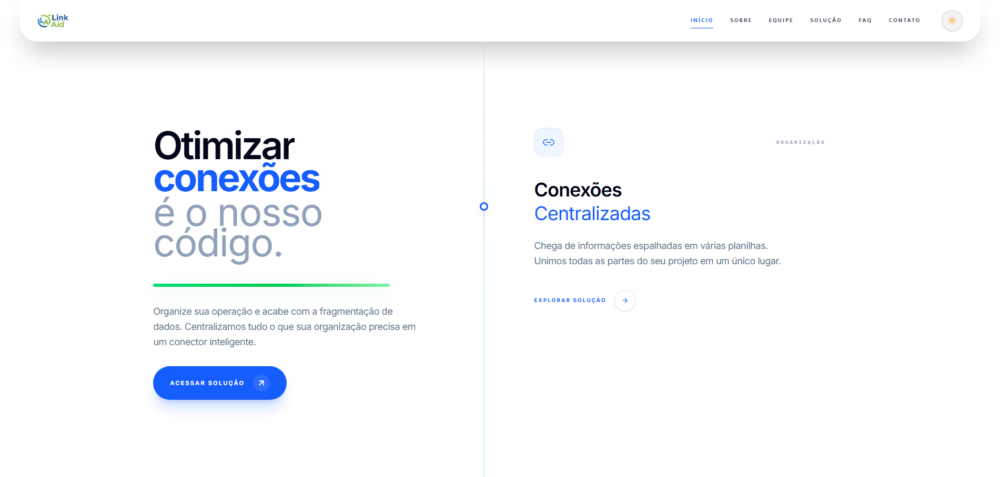

<div align="center">

# LinkAid
A vitrine digital da próxima geração em automação e centralização de contatos.

<div>
  
  
  
</div>

<br/>

🔗 **Acesse o repositório do projeto**
👉 [github.com/juliarichesky/linkaid](https://github.com/juliarichesky/linkaid)

🔗 **Acesse o vídeo:**
👉 [YouTube](xxx)

🔗 **Veja o site online:**
👉 [link-aid-connect.vercel.app](https://link-aid-connect.vercel.app/)

<br/>



<br/> 

<div align="left">
  
> Projeto desenvolvido durante o curso da **FIAP** para o **Challenge**.

> Este repositório contém o Front-End do site institucional e de apresentação do LinkAid. O objetivo é fornecer uma experiência de usuário impecável, rápida e totalmente responsiva para apresentar a solução LinkAid ao mercado corporativo.

---
<br/>

## 🌟 Objetivo e Problema Resolvido
### O Problema: A Fragmentação da Experiência Digital
No cenário atual, empresas e profissionais lidam com um problema comum: a comunicação está espalhada em vários lugares. São links perdidos, atendimentos feitos manualmente e tempo desperdiçado alternando entre diferentes plataformas. Essa falta de organização dificulta o contato, gera confusão e pode fazer oportunidades importantes se perderem.

O **LinkAid** surge como a solução para esse cenário. Ele é um painel inteligente que centraliza todos os pontos de contato em um único lugar. Com uma interface simples e intuitiva, o LinkAid organiza, automatiza e otimiza a comunicação, tornando o atendimento mais ágil, eficiente e profissional.

<br/>

## 🎯 Pilares da Plataforma
* **Centralização Profissional:** Um hub único para todos os seus ativos e canais de contato.
* **Performance & Escalabilidade:** Site otimizado com React para carregamento instantâneo.
* **Design Humanizado:** Interface limpa que foca na facilidade de uso, reduzindo a carga cognitiva do usuário.

<br/>

### 📐 Responsividade
O layout foi desenvolvido para funcionar perfeitamente em:

- 📱 Mobile (até 480px)  
- 📲 Tablet (até 768px)  
- 💻 Desktop (992px+)  
- 🖥️ Telas grandes (1300px+)  

<br/>

## 🚀 Stack Tecnológica
O front-end do **LinkAid** foi desenvolvido com tecnologias de ponta para garantir performance, segurança e uma experiência de usuário fluida.

| Tecnologia | Função | Descrição |
| :--- | :--- | :--- |
|  | **Framework** | Biblioteca principal para criação de interfaces baseadas em componentes reutilizáveis. |
|  | **Linguagem** | Superset de JavaScript que adiciona tipagem estática e segurança ao código. |
|  | **Estilização** | Framework utility-first para um design responsivo, moderno e de carregamento rápido. |
|  | **Build Tool** | Ferramenta de build de próxima geração para um ambiente de desenvolvimento ágil. |

<br/>

## 💻 Entregas Funcionais
Abaixo estão as funcionalidades centrais implementadas no Frontend:

| Categoria | Tecnologia / Recurso | Status | Uso no Projeto |
| :--- | :--- | :---: | :--- |
| **Definição de Rotas** | **React Router Dom** | :heavy_check_mark: | Estruturação das rotas da aplicação para organização das páginas e fluxo de navegação entre módulos do sistema. |
| **Navegação SPA** | **Navegação Fluida** | :heavy_check_mark: | Implementação de navegação sem recarregamento de página, garantindo experiência fluida em toda a aplicação. |
| **Parâmetros e Rotas Dinâmicas** | **useParams** | :heavy_check_mark: | Uso de parâmetros dinâmicos para identificação e carregamento de conteúdos específicos através da URL. |
| **Feedback ao Usuário** | **Mensagens e Estados Visuais** | :heavy_check_mark: | Implementação de feedback visual para carregamento, sucesso, falha e estados da aplicação, melhorando a experiência do usuário. |
| **Criação de Tipos de Dados** | **TypeScript** | :heavy_check_mark: | Estruturação de tipagem para garantir maior segurança, previsibilidade e manutenção do código. |
| **Tipos Básicos** | **string, number, boolean, arrays e object** | :heavy_check_mark: | Utilização de tipos básicos em diversos componentes para definição e manipulação de dados. <br>Ex.: `FaqSearch.tsx`, `technologies.ts`, `TeamSection.tsx`. |
| **Interfaces** | **interface** | :heavy_check_mark: | Uso extensivo de interfaces para modelagem de entidades e tipagem de props. <br>Ex.: `Ticket`, `User`, `ButtonProps`. |
| **Union Types** | **Tipos Literais** | :heavy_check_mark: | Implementação de tipos restritivos utilizando unions para aumentar segurança de dados. <br>Ex.: `Theme = "light" \| "dark"` e `Role = "admin" \| "colaborador"`. |
| **Intersection Types** | **Composição de Tipos** | :heavy_check_mark: | Combinação e adaptação de tipos através de `Omit<>`, `extends` e `React.HTMLAttributes`. <br>Ex.: `linkaidApi.ts`, `tabs.tsx`. |
| **Tipos Avançados** | **TypeScript Avançado** | :heavy_check_mark: | Aplicação de recursos avançados para composição e reutilização de estruturas tipadas. |
| **Responsividade Total** | **Mobile / Tablet / Desktop** | :heavy_check_mark: | Desenvolvimento adaptável para diferentes tamanhos de tela, garantindo compatibilidade em múltiplos dispositivos. |
| **Consumo de API** | **Fetch API** | :heavy_check_mark: | Integração com APIs para obtenção e envio de dados dinâmicos utilizados pela aplicação. |
| **Manipulação HTTP** | **GET, POST, PUT, DELETE** | :heavy_check_mark: | Implementação completa dos principais métodos HTTP para operações de consulta, criação, atualização e remoção de dados. |
| **Tratamento de Dados e Erros** | **try/catch e ApiError** | :heavy_check_mark: | Implementação de tratamento de respostas inesperadas e gerenciamento de erros através do `request()` presente em `linkaidApi.ts`, realizando validações, tratamento de status HTTP e mensagens personalizadas. |
| **Tratamento de Respostas** | **Serialização e Controle de Fluxo** | :heavy_check_mark: | Conversão automática de JSON, validação de respostas (`response.ok`) e tratamento de respostas vazias (`204 No Content`). |
| **Organização do Projeto** | **Arquitetura Modular** | :heavy_check_mark: | Estruturação organizada em componentes, páginas, contextos, serviços, hooks e tipagens, visando manutenção, escalabilidade e reutilização de código. |

<br/>

## 📁 Estrutura de Pastas

```text
plataforma/
│
├── public/ → arquivos públicos acessados diretamente pelo navegador
│   └── favicon.ico
│
├── src/
│   │
│   ├── assets/ → arquivos estáticos utilizados pela aplicação
│   │   ├── icons/ → ícones utilizados no sistema
│   │   └── images/ → imagens organizadas por contexto
│   │       ├── 404/ → imagens da página de erro
│   │       ├── contact/ → imagens da página de contato
│   │       ├── painel/ → imagens internas da plataforma/dashboard
│   │       ├── site/ → imagens gerais do site
│   │       └── team/ → fotos e imagens da equipe
│   │
│   ├── components/ → componentes reutilizáveis da aplicação
│   │   │
│   │   ├── feedback/ → componentes de feedback visual
│   │   │   └── Toaster.tsx
│   │   │
│   │   ├── layout/ → componentes estruturais do sistema
│   │   │   ├── AppHeader.tsx
│   │   │   ├── AppLayout.tsx
│   │   │   ├── AppSidebar.tsx
│   │   │   └── TeamPanel.tsx
│   │   │
│   │   ├── ui/ → componentes genéricos reutilizáveis
│   │   │   ├── button.tsx
│   │   │   ├── card.tsx
│   │   │   ├── dialog.tsx
│   │   │   ├── input.tsx
│   │   │   ├── table.tsx
│   │   │   └── tabs.tsx
│   │   │
│   │   └── componentes específicos → componentes das páginas
│   │
│   ├── contexts/ → gerenciamento global de estados
│   │   ├── AuthContext.tsx → autenticação do usuário
│   │   ├── ThemeContext.tsx → gerenciamento de tema
│   │   └── TicketsContext.tsx → gerenciamento de tickets
│   │
│   ├── data/ → arquivos de dados estáticos
│   │   ├── developers.json → informações da equipe
│   │   ├── faq.ts → perguntas frequentes
│   │   ├── features.json → funcionalidades do sistema
│   │   └── tecnologies.ts → tecnologias utilizadas
│   │
│   ├── layouts/ → layouts compartilhados
│   │   ├── DefaultLayout.tsx → layout padrão
│   │   ├── HeroDefault.tsx → layout de hero sections
│   │   └── HomeLayout.tsx → layout da home
│   │
│   ├── lib/ → funções auxiliares e integração externa
│   │   ├── linkaidApi.ts → comunicação com API
│   │   ├── linkaidMappings.ts → mapeamentos
│   │   ├── masks.ts → máscaras de dados
│   │   ├── ticketDisplay.ts → regras de exibição
│   │   └── variants.ts → variações e constantes
│   │
│   ├── pages/ → páginas principais da aplicação
│   │   │
│   │   ├── platform/ → páginas internas da plataforma
│   │   │   ├── Dashboard.tsx → painel principal
│   │   │   ├── Tickets.tsx → gerenciamento de tickets
│   │   │   ├── TicketDetail.tsx → detalhes do ticket
│   │   │   ├── CreateTicket.tsx → criação de tickets
│   │   │   ├── History.tsx → histórico
│   │   │   ├── Contacts.tsx → contatos
│   │   │   ├── Reports.tsx → relatórios
│   │   │   ├── Financial.tsx → financeiro
│   │   │   ├── Settings.tsx → configurações
│   │   │   ├── Login.tsx → autenticação
│   │   │   └── NotFound.tsx → página de erro
│   │   │
│   │   └── site/ → páginas institucionais
│   │       ├── Home/ → página inicial
│   │       ├── Sobre/ → informações do projeto
│   │       ├── Faq/ → perguntas frequentes
│   │       ├── Contato/ → contato
│   │       ├── Equipe/ → equipe do projeto
│   │       ├── Mapa/ → localização/mapa
│   │       └── NotFound/ → página não encontrada
│   │
│   ├── routes/ → gerenciamento das rotas
│   │   ├── platform.ts → definições das rotas
│   │   └── PlatformRoutes.tsx → agrupamento das rotas
│   │
│   ├── types/ → interfaces e tipagens globais
│   │
│   ├── App.tsx → componente raiz da aplicação
│   ├── main.tsx → ponto de inicialização do React
│   ├── index.css → estilos globais
│   └── vite-env.d.ts → definições do Vite
│
├── index.html → arquivo principal HTML
├── package.json → dependências e scripts
├── vite.config.ts → configuração do Vite
├── tailwind.config.ts → configuração do Tailwind
├── tsconfig.json → configuração TypeScript
└── vercel.json → configuração de deploy
└── README.md → documentação do projeto
```

<br/>

## 🚀 Execução
Siga os passos abaixo para executar o projeto localmente:

> ⚠️ Esse projeto faz parte do repositório principal do LinkAid.  
> Para o funcionamento completo da aplicação, é necessário executar o **backend** e o **frontend** simultaneamente.

<br/>

### Clonando o repositório
```bash
git clone https://github.com/juliarichesky/linkaid.git
cd LinkAid
```

---

## ▶️ Executando o Backend / API
A API foi desenvolvida em **Java 17** com **Quarkus** e utiliza banco de dados **Oracle**.
Acesse a pasta do backend:
```bash
cd backend/api
```

Configure as variáveis de ambiente necessárias para conexão com o banco Oracle:

### Windows (PowerShell)
```bash
$env:ORACLE_USERNAME="rm"
$env:ORACLE_PASSWORD="senha"
$env:ORACLE_JDBC_URL="jdbc:oracle:thin:@host:porta/service"
$env:PORT="8080"
```

### Linux / macOS
Garanta permissão de execução no Maven wrapper:
```bash
chmod +x ./mvnw
```

Configure as variáveis de ambiente:
```bash
export ORACLE_USERNAME="rm"
export ORACLE_PASSWORD="senha"
export ORACLE_JDBC_URL="jdbc:oracle:thin:@host:porta/service"
export PORT="8080"
```

Depois execute a aplicação em modo desenvolvimento:

### Windows (PowerShell)
```bash
mvnw.cmd quarkus:dev
```

### Linux / macOS
```bash
./mvnw quarkus:dev
```

A API estará disponível em:
👉 http://localhost:8080

A documentação Swagger estará disponível em:
👉 http://localhost:8080/swagger-ui

</br>

## ▶️ Executando o Frontend
Com o backend ainda em execução, abra um **novo terminal** e acesse a pasta do frontend:
```bash
cd front-end
```

Instale as dependências:
### Windows (PowerShell)
```powershell
npm install
```

### Linux / macOS
```bash
npm install
```

### Configuração da API
O frontend já possui configuração automática para ambiente local.
Durante o desenvolvimento (`npm run dev`), caso nenhuma variável seja definida, a aplicação utilizará automaticamente:

```bash
http://localhost:8080
```

Opcionalmente, é possível sobrescrever a URL da API através de uma variável de ambiente.

### Windows (PowerShell)
```powershell
$env:VITE_API_URL="http://localhost:8080"
```

### Linux / macOS
```bash
export VITE_API_URL="http://localhost:8080"
```

> Caso nenhuma variável seja informada, o sistema utilizará automaticamente a configuração padrão para desenvolvimento local.

Execute a aplicação:
### Windows (PowerShell)
```powershell
npm run dev
```

### Linux / macOS
```bash
npm run dev
```

O frontend estará disponível em:
👉 http://localhost:5173

</br>

## 🔗 Integração entre Frontend e Backend

Para funcionamento completo da aplicação, o backend e frontend precisam estar executando simultaneamente.

| Serviço | Tecnologia | URL local |
| :--- | :--- | :--- |
| Backend / API | Java + Quarkus | http://localhost:8080 |
| Frontend | React + Vite | http://localhost:5173 |

> Caso o backend não esteja em execução, o frontend continuará abrindo normalmente, porém funcionalidades que dependem da API (login, dashboard, tickets, contatos, relatórios, financeiro e demais recursos dinâmicos) poderão apresentar erros ou não carregar informações.

---

</br>

## 🤝 Contribuidores

<table>
  <tr>
    <td align="center">
      <a href="https://github.com/juliarichesky">
        <br>
        <sub><b>Julia Guimarães</b></sub>
      </a><br>
      RM: 568275<br>
      Turma: 1TDSPA<br><br>
      <a href="https://www.linkedin.com/in/juliarichesky/">
        
      </a>
      <a href="https://github.com/juliarichesky">
        
      </a>
    </td>
    <td align="center">
      <a href="https://github.com/juspanopoulos">
        <br>
        <sub><b>Julia Spanopoulos</b></sub>
      </a><br>
      RM: 566754<br>
      Turma: 1TDSPA<br><br>
      <a href="https://www.linkedin.com/in/juspanopoulos/">
        
      </a>
      <a href="https://github.com/juspanopoulos">
        
      </a>
    </td>
  </tr>
</table>

</br>

## 📬 Contato da Equipe
Caso tenha dúvidas ou sugestões:

📧 **Julia Guimarães:** juliavaleriogs@gmail.com
<br/>
📧 **Julia Spanopoulos:** jusspan@gmail.com
<br/>

[](https://github.com/juliarichesky/linkaid)

</div>
</div>
